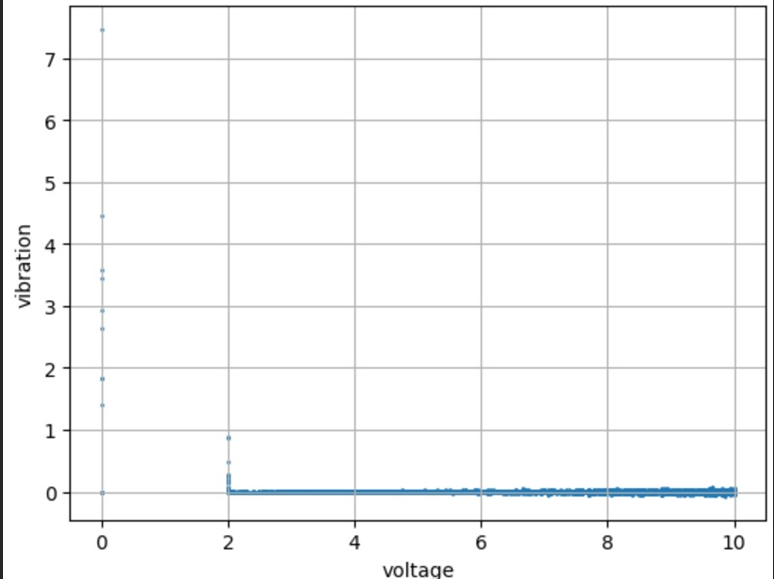

# Enhancing Machinery Health through Abnormal Data Detection with ASW and WMLOF

In Machinery Health Monitoring (MHM), accuracy and reliability hinge on detecting abnormal data and enhancing its quality. Traditional methods struggle with MHM data dynamic nature. To overcome this, we propose the Adaptive Sliding Window (ASW) method, which prevents data leakage and redundancy. We introduce the Entropy Weighted Matrix, which assesses anomaly degrees across multiple scales by integrating local outlier factors comprehensively. Comparative analysis validates effectiveness, demonstrating their superiority over established algorithms. This adaptive approach excels in identifying abnormal data in MHM, outperforming previous methods. ASW and EWM on LOF holds promise for enhancing machinery reliability and maintenance practices in various industries.


Keywords: Local Outlier Factor,Adaptive Sliding window,Entropy Weighted Matrix

### Notable contributions of the paper are:

-	This paper abbreviates about the problems faced in machine health monitoring due to the increase in the size of the data and the shortcomings of the traditional anomaly detection algorithms and proposes a novel a novel method by using ASW,EWM and LOF.


### Techniques used are:
-	Adaptive Sliding Window: Unlike the normal sliding window this changes the length of the window actively depending on the requirement.
-	Entropy Weighted Matrix: This method finds the uncertainty in the data .
-	Local Outlier Factor: A density based abnormalities detection algorithm which highly depends on the number of neighbors and the threshold value. 


### MERITS AND DEMERITS:

#### MERITS:
1. The paper proposes a method which not only reduce the data leakage and redundancy but also finds the uncertainty in the data to minimize its influence on the result.
2. Integration of different techniques: ASW, EWM and LOF such Machine Learning Techniques and Novel methods are integrated here to increase the efficiency.
3. Scalability: Modern machines generated huge data which is hard to process. The enhanced  method can handle such data effectively.

#### DEMERITS:
1.	 By adding new methods for effective detection of anomaly the processing time has increased.
2.	Lof has a best case of nlog(n) which is not attainable with the new method.
3.	Finding the best suitable lambda value requires a lot of tuning.
4.	There are other algorithm which provides more effective detection in some cases.

# Problem Statement
- Existing methods for detecting abnormal data in machinery health monitoring (MHM) systems often rely on predetermined parameter settings leading to incorrect diagnostic outcomes.

- Hence forth, providing a adaptive anomaly detection methods capable of effectively analyzing MHM data to identify and mitigate anomalies is crucial.


# Dataset Visualization



# Proposed Techniques (Architecture)


# Algorithms
## 1. LOCAL OUTLIER FACTOR(LOF):
 The Local Outlier Factor (LOF) algorithm is an unsupervised anomaly detection method used to identify outliers in datasets. LOF measures the local deviation of density of a given data point with respect to its neighbors. Here's a basic outline of the algorithm:
 
#### 1. Input:
   - Dataset: ( D = {x_1, x_2, ..., x_n} ) where ( x_i ) is a data point.
   - Number of nearest neighbors to consider: k.
#### 2. Calculate Distances:
   - Compute the distance between each pair of points in the dataset. This distance can be Euclidean distance, Manhattan distance, etc.
### 3. Compute Reachability Distance:
   - For each point ( x_i ), find its ( k ) nearest neighbors.
   - Compute the reachability distance ( RD(x_i, x_j) ) from ( x_i ) to each of its neighbors ( x_j ).
#### 4. Compute Local Reachability Density (LRD):
   - For each point ( x_i ), compute its local reachability density ( LRD(x_i) ) as the inverse of the average reachability distance from ( x_i ) to its ( k ) nearest neighbors.
      - Where ( N_k(x_i) ) represents the set of ( k ) nearest neighbors of ( x_i ).
#### 5. Compute Local Outlier Factor (LOF):
   - For each point ( x_i ), compute its LOF as the ratio of the average LRD of its ( k ) nearest neighbors to its own LRD.

## 2. ADAPTIVE SLIDING WINDOW(ASW):   
1. Initialize an empty list to store segments: segments = []
2. Start a new segment with the first data point: current_segment = [data[0]]
3. Iterate through the data points starting from the second one:
  - If the absolute difference between the current point and the last point in the current segment is less than or equal to the threshold:
 - Add the point to the current segment: current_segment.append(data[i])
 - If the absolute difference exceeds the threshold:
 - Add the current segment to the list of segments: segments.append(current_segment)
 - Start a new segment with the current point: current_segment = [data[i]]
4. Add the last segment to the list of segments: segments.append(current_segment)
  
### 3. NORMALIZATION:
Given a decision matrix X with n alternatives and m criteria, we need to normalize the values in each column (criteria) so that they are in the same range. This step ensures that all criteria contribute equally to the decision-making process.
Algorithm:
 Input: Decision matrix X of size n×m
Output: Normalized decision matrix X′of size n×m

1. Initialize:
    Create an empty matrix X’ of the same size as X
2. For each criterion j from 1 to m:
- Find the minimum value minj and maximum value maxj in column j of matrix X.
 
3. For each element xij in matrix X:
- Normalize the value using min-max normalization:
 
 
            -Add the normalized value to the  corresponding position in matrix X’
 
 
4. X’ is the normalized decision matrix.


# Source Code
## DATA PREPROCESSING
```py
import pandas as pd
import matplotlib.pyplot as plt
import numpy as np
from sklearn.neighbors import LocalOutlierFactor
df=pd.read_csv(r'C:\Users\Koushik\Desktop\Mini_Proj\archive\a.csv')
x = df['V_in']
y = df['Vibration_1']
X1, X2, y1, y2 = train_test_split(x, y, test_size=0.00077)
test= pd.concat([X2,y2], axis=1)
test
```

## DATA VISUALIZATION
```py
plt.scatter(X2, y2, marker='o', linestyle='-',s=1)
plt.xlabel('voltage')
plt.ylabel('vibration')
plt.grid(True)
plt.show()
df= pd.DataFrame()
df['v']=X2
df['vibration1']=y2
series=pd.Series(y2)
```
## LOCAL OUTLIER DETECTION
```py
mean_value = series.mean()
std_deviation=series.std()
model = LocalOutlierFactor(n_neighbors=40, contamination=std_deviation*.707+mean_value)
outlier_scores = model.fit_predict(df)
negative_outlier_scores = model.negative_outlier_factor_
print(outlier_scores)
df['anomoly']=outlier_scores
df['outlier_scores']=-negative_outlier_scores
plt.figure(figsize=(10, 6))
plt.scatter(df['v'], df['vibration1'], c=df['anomoly'], cmap='viridis', s=1)
plt.colorbar(label='LOF Score')
plt.xlabel('Feature 1')
plt.ylabel('Feature 2')
plt.title('LOF Density Plot')
plt.show()
```
## ADAPTIVE SLIDING WINDOW
```py
import math
def dist(a1,a2,b1,b2):
 return math.sqrt((a1 - a2) ** 2+(b1 - b2) ** 2)
vibe=np.array(df['vibration1'])
volt=np.array(df['v'])
segments = []
current_segment = [vibe[0]] 
c_volt=[volt[0]]
thershold=0
j=1
for i in range(1, len(vibe)):
        distance = dist(vibe[i],current_segment[-1],volt[i],c_volt[-1])
    if (((distance <= (thershold/j)*5 ) | (j==1))&(j<100)):
        j=j+1
        current_segment.append(vibe[i])
        c_volt.append(volt[i])
        thershold=distance+thershold
    else:
        j=1
        segments.append(current_segment)
        current_segment = [vibe[i]]
        c_volt=[volt[i]] 
        thershold=0
segments.append(current_segment)
```

## ENTROPY WEIGHTED MATRIX
```py
from scipy.stats import entropy
import numpy as np
csegments=pd.Series(segments)
Div_k = [abs(1 - entropy(pd.Series(segment).value_counts(normalize=True))) for segment in csegments]
Div_k
print(len(Div_k))
wei=[(100*Div_k[i]/np.sum(Div_k[0:len(Div_k)]))+0*y for i,segment in enumerate(segments) for y in segment]
print("Weighted Matrix:")
print(wei)
print(len(wei))
df['weight']=wei
```

## VISUALIZING ENTROPY WEIGHTS
```py
n_anomoly=df[df['anomoly']==1]
n_anomoly
s_anomoly=df[df['anomoly']==-1]
plt.figure(figsize=(10, 6))
plt.scatter(n_anomoly['v'], n_anomoly['vibration1'], c=n_anomoly['weight'], cmap='viridis', s=1)
plt.colorbar(label='LOF Score')
plt.xlabel('Feature 1')
plt.ylabel('Feature 2')
plt.title('LOF Density Plot')
plt.show()
plt.figure(figsize=(10, 6))
plt.scatter(s_anomoly['v'], s_anomoly['vibration1'], c=s_anomoly['weight'], cmap='viridis', s=1)
plt.colorbar(label='LOF Score')
plt.xlabel('Feature 1')
plt.ylabel('Feature 2')
plt.title('LOF Density Plot')
plt.show()
```

## WMLOF
```py
uw=[]
for i,w in enumerate(df['weight']):
 uw.append(w*.5*-negative_outlier_scores[i])
wei=pd.Series(uw)
t=pd.Series.std(wei)+pd.Series.mean(wei)
updated_anomoly=[]
j=0
for i,w in enumerate(df['weight']):
    if (w>t):
        j=j+1
        updated_anomoly.append(outlier_scores[i]*-1)
    else:
        updated_anomoly.append(outlier_scores[i])
        #print("else")
df['ua']=updated_anomoly
plt.figure(figsize=(10, 6))
plt.scatter(df['v'], df['vibration1'], c=df['ua'], s=1)
plt.colorbar(label='LOF Score')
plt.xlabel('Feature 1')
plt.ylabel('Feature 2')
plt.title('LOF Density Plot')
plt.show()
```
## COMPARING LOF AND PROPROSED METHOD
```py
from sklearn.metrics import silhouette_score
clusters = np.where(outlier_scores == -1, 0, 1) 
silhouette_avg = silhouette_score(df,clusters)
print("The average silhouette_score is :", silhouette_avg)

clusters = np.where(df['ua'] == -1,0, 1) 
silhouette_avg = silhouette_score(df,clusters)
print("The average silhouette_score is :", silhouette_avg)
```


# CONCLUSION AND FUTURE PLANS

The proposed method for anomaly detection using EWM,ASW AND LOF has significant potential for increasing data quality and reduce uncertainty in the data.It effectively detects slight anomaly signals.In the field of machine health monitoring such qualities are essential to prevent machinery faults.Further we can  increase  the efficiency to find anomalies meeting the real time demand of the practical machinery health monitoring and to make this algorithm suitable for any kind of machinery data.
